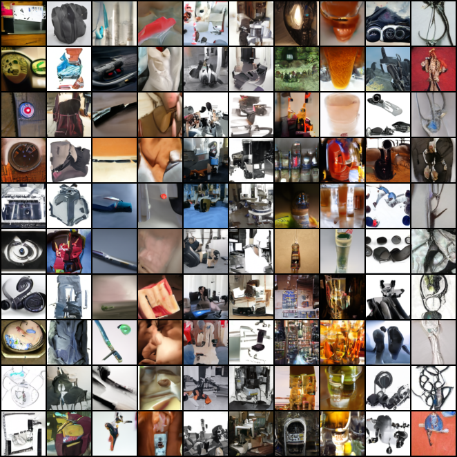

# DDPM-CFG

基于 DDPM 的 Classifier-Free Guidance 条件扩散模型实现。

## 更新日志

已完成：
- ✅ v1 版本（底层手搓实现）

待办：
- ⬜ 现代化工程封装（PyTorch Lightning、日志系统、Hydra 配置管理）
- ⬜ 其他质量更好的数据集

## 目录结构

```
├── train.py              # 训练入口
├── sample.py             # 采样脚本
├── config.json           # 配置文件
├── models/               # 模型定义（UNet、Diffusion CFG）
├── utils/                # 工具函数（数据加载、噪声调度器）
├── datasets/             # 数据集目录
├── ckpt/                 # 模型检查点
└── sampled_images/       # 生成样本保存目录
```

## 环境配置

使用 [uv](https://github.com/astral-sh/uv) 管理依赖（[uv官方文档](https://docs.astral.sh/uv/)）：

```bash
# 同步环境配置
uv sync
```

## 快速开始

1. **准备数据集**

   本项目使用 Mini-ImageNet（数据来源：[ModelScope](https://www.modelscope.cn)，大陆访问友好）
   
   ```bash
   bash fetch_data.sh
   ```
   
   数据将自动下载至 `datasets/mini_imagenet/` 目录。

2. **修改配置**（可选）

   编辑 `config.json` 调整训练参数与模型配置。

3. **训练模型**

   ```bash
   uv run train.py
   ```

4. **采样生成**

   ```bash
   uv run sample.py
   ```
   
   生成结果保存于 `sampled_images/` 目录：

   

## 参考

- [Classifier-Free Diffusion Guidance](https://arxiv.org/abs/2207.12598)
