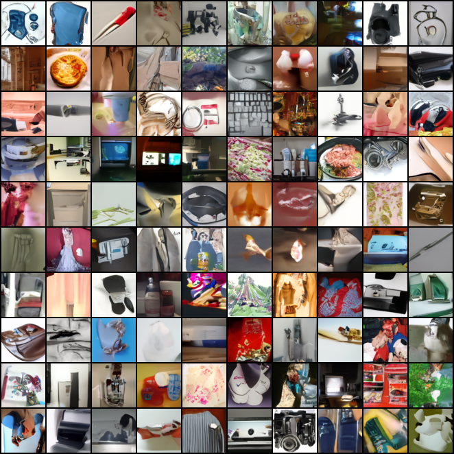

# DDPM-CFG

基于 DDPM 的 Classifier-Free Guidance 条件扩散模型实现。

## 更新日志

已完成：
- ✅ v1 版本（底层手搓实现）
- ✅ v2 版本（Lightning、loguru、Hydra）

> **版本切换说明**：本项目使用 Git 分支管理不同版本，当前默认分支为 `v2`。
> 
> | 分支 | 说明 |
> |------|------|
> | `v1` | 底层手搓实现（纯PyTorch，适合学习原理） |
> | `v2` | 工程化实现（Lightning + Hydra + loguru，适合生产） |
> 
> **切换版本：**
> ```bash
> # 切换到 v1 版本
> git checkout v1
> 
> # 切换回 v2 版本
> git checkout v2
> 
> # 查看所有分支
> git branch -a
> ```

待办：
- ⬜ 其他质量更好的数据集

## 目录结构

```
├── main.py               # 训练和推理入口
├── configs/              # 配置文件目录（Hydra）
├── models/               # 模型定义（UNet、Diffusion CFG）
├── utils/                # 工具函数（数据加载、噪声调度器）
├── datasets/             # 数据集目录
├── ckpt/                 # 模型检查点
└── sampled_images/       # 生成样本保存目录
```

## 环境配置

使用 [uv](https://github.com/astral-sh/uv) 管理依赖（[uv官方文档](https://docs.astral.sh/uv/)）：

```bash
# 同步环境配置
uv sync
```

## 快速开始

1. **准备数据集**

   本项目使用 Mini-ImageNet（数据来源：[ModelScope](https://www.modelscope.cn/datasets/tany0699/mini_imagenet100)，大陆访问友好）
   
   ```bash
   bash fetch_data.sh
   ```
   
   数据将自动下载至 `datasets/mini_imagenet/` 目录。

2. **修改配置**（可选）

   编辑 `configs/config.yaml` 调整训练参数与模型配置。

3. **训练模型**

   ```bash
   # 默认的config中配置针对2块24G显存的gpu，请根据实际情况修改config.train.gpus
   uv run main.py mode.train=true
   ```

4. **采样生成**

   ```bash
   # 推理模式使用 1*24G显存的gpu，默认采样batch=100张图像
   uv run main.py mode.train=false 
   ```
   生成结果保存在 `sampled_images/` 目录下。

   结果示例：

   

## 参考

- [Classifier-Free Diffusion Guidance](https://arxiv.org/abs/2207.12598)
